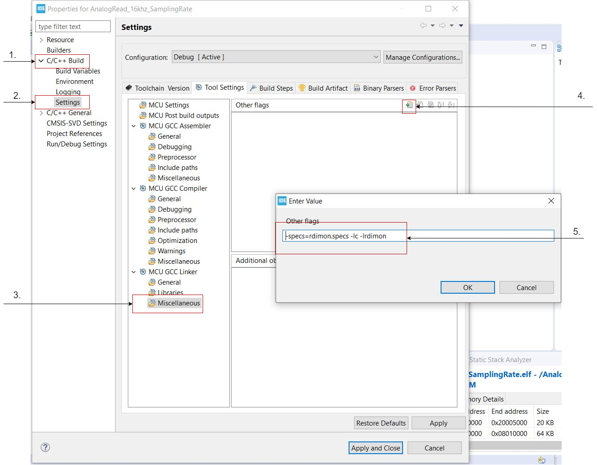
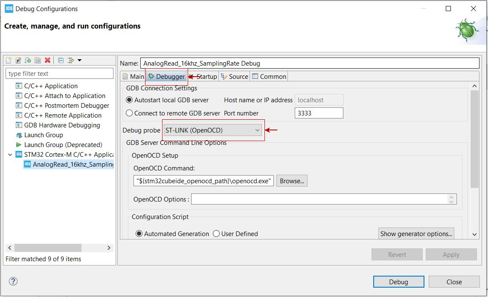
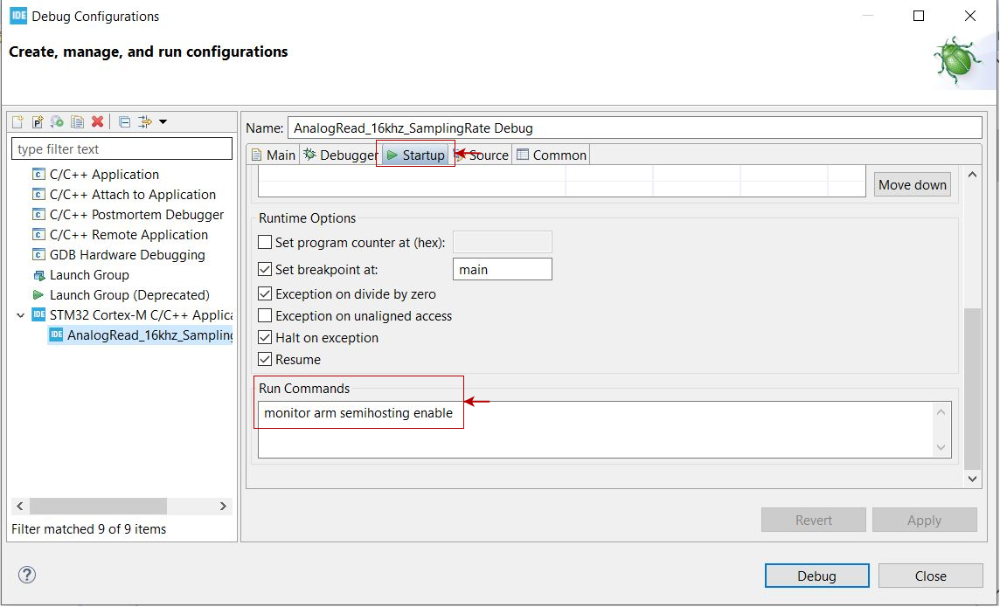
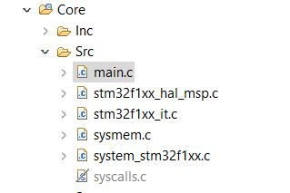

# Setting up printf() using semihosting and OpenOCD

For printing ADC values on STM32CubeIDE console and for debugging purposes we need to set up printf(). Follow the following steps for the same.

## Steps

1. Right click on project --> Go to properties --> Explore C/C++ Build --> Settings --> In MCU GCC Linker select Miscellaneous --> On other flags click on Add and type _**-specs=rdimon.specs -lc -lrdimon**_ then click Apply and Close.

2. Goto Debug Configurations --> In debugger tab select debug probe as ST-LINK(OpenOCD). Then goto Startup tab, in run commands enter _**monitor arm semihosting enable**_, click apply and close.

3. In project explorer --> explore core --> explore src --> right click on syscalls.c --> click on properties --> check Exclude resource from build.
After doing this, syscalls.c will look like this:

4. In private function prototype area extern this function:
    _**extern void initialise_monitor_handles(void);**_
Call this function before using any of printf() statement.
    _**initialise_monitor_handles();**_

5. That's all, printf() must now work normally, don't forget to include _**"stdio.h"**_.
