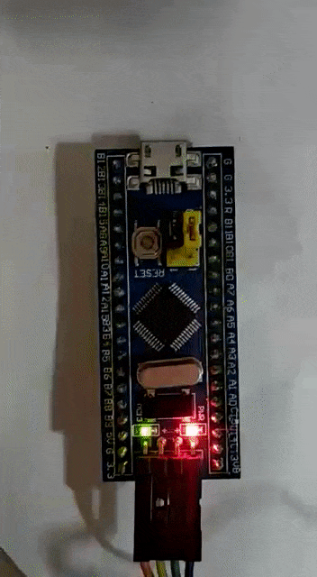

# Digital Write Example --

Code is generated using STM32CubeMX where all desired configuration is set.
In this example we have configured PC13 pin, which is connected to on-board LED as GPIO output. Also we added a user label "LED" to pin PC13. The loop section of code contains one statement to toggle the pin and other for delay.

<p align="center">
  
</p>

## Some of the common functions are:

1. ```HAL_GPIO_TogglePin(GPIOx, GPIO_Pin);```
2. ```HAL_GPIO_WritePin(GPIOx, GPIO_Pin, PinState);```
3. ```HAL_DELAY(delay);```
4. ```HAL_GPIO_ReadPin(GPIOx, GPIO_Pin);```
